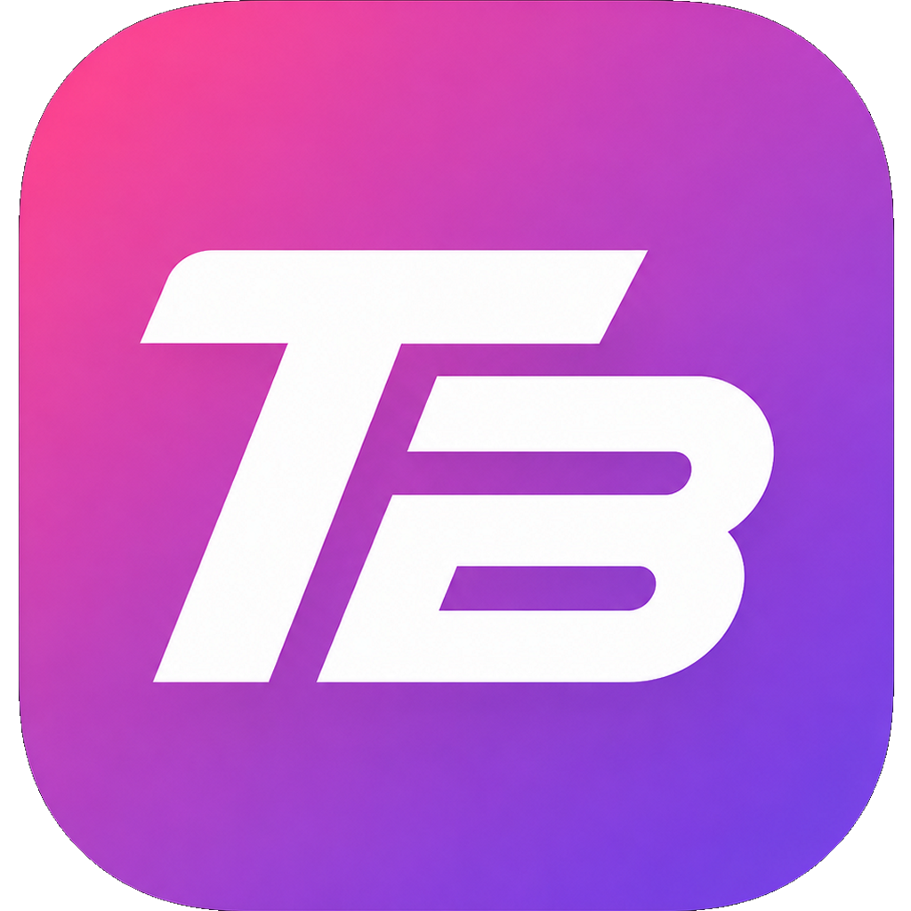
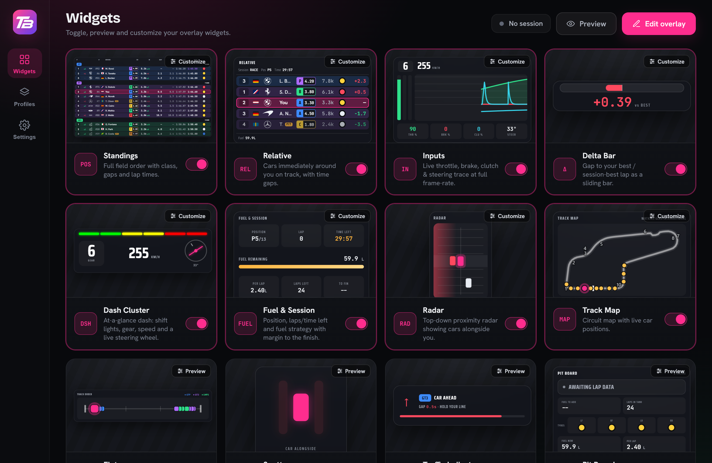

# Trailbrake

**A fast, fully-customizable telemetry overlay for sim racing.**

Build the heads-up display you actually want — standings, inputs, fuel, radar,
track map and more — composited right over your game, in real time.

### [⬇&nbsp; Download for Windows](https://github.com/isaachansen/trailbrake/releases/latest) &nbsp;·&nbsp; [Features](#features) &nbsp;·&nbsp; [Widgets](#widgets) &nbsp;·&nbsp; [FAQ](#faq)

 

---

## What is Trailbrake?

Trailbrake is a transparent, always-on-top overlay that draws live telemetry on
top of your sim while you drive. A separate, polished **manager** lets you pick
widgets, arrange them by drag-and-drop, tune every detail, and save layouts —
then it gets out of the way: the overlay appears automatically when you go on
track and hides when the session ends.

It's built to be **invisible to your frame rate**. The overlay is its own window,
and the high-rate inputs (pedals, rpm, steering at ~60 Hz) are drawn outside
React so heavy panels never re-render in the hot path.

## Download

**[Get the latest release →](https://github.com/isaachansen/trailbrake/releases/latest)**
Grab `Trailbrake_x.y.z_x64-setup.exe`, run it, and launch Trailbrake from the
Start menu.

- **Windows 10 / 11.** Live telemetry currently supports **iRacing** (auto-detected).
- The alpha build is **unsigned**, so Windows SmartScreen will say *"Windows
  protected your PC"* — click **More info → Run anyway**. This goes away once the
  app is code-signed.
- **It updates itself.** Installed copies check for new releases and update in
  place — no reinstalling.

## Features

- 🎛️ **29 widgets** — timing, inputs, awareness, strategy and stream tools (full list below).
- 🖱️ **Drag-and-drop edit mode** — move and resize widgets right on the overlay; a global hotkey toggles it even while the game is focused.
- 🎚️ **Per-widget tuning** — opacity, scale, when each widget shows, plus widget-specific options, all live-previewed.
- 💾 **Profiles + per-car auto-switch** — save multiple layouts and have Trailbrake load the right one automatically for the car you hop into.
- 👁️ **Preview & demo mode** — design your HUD with realistic mock data without a sim even running; live telemetry takes over the moment you're on track.
- 🖥️ **Multi-monitor** — drop the overlay on a second display, or right over a borderless game.
- 📐 **Metric or imperial** units across every widget.
- 🥽 **VR** *(opt-in build)* — mirror widgets as individually-placed floating panels in your headset via SteamVR.
- 🧠 **Capability-aware** — widgets a given sim can't feed simply hide themselves, so your HUD always reflects real data (never fakes a value).

## Widgets

| Category | Widgets |
| --- | --- |
| **Timing & laps** | Standings · Relative · Delta Bar · Lap Timer · Sector Delta |
| **Dash & inputs** | Dash Cluster · Tachometer · Inputs (throttle/brake/clutch/steering) |
| **Awareness** | Radar · Spotter · Track Map · Flatmap · Traffic Indicator · Slow Car Ahead · Corner Name · Highlighted Driver |
| **Strategy & pit** | Fuel & Session · Pit Board · Pitlane Helper · Launch Assist · Weather |
| **Race control & stream** | Flag · Race Control · Chat · Garage Cover · Rejoin Indicator |
| **Extras** | Telemetry Inspector · Setup Comparison · Heart Rate |

Every widget is resizable, themeable, and shows only when it has data to show.

## Getting started

1. **Install** the latest release and launch Trailbrake — it opens the manager
   window and lives in your system tray.
2. **Pick your widgets** on the *Widgets* page (toggle them on, click any card to
   customize it live).
3. **Arrange them** — hit *Edit overlay*, then drag and resize widgets directly
   on screen. Click *Done editing* to lock them.
4. **Drive.** Start iRacing and the overlay shows automatically with live data,
   then hides when the session ends.
5. **No sim handy?** Flip on *Preview* (and *Demo data*) in the topbar to lay out
   and admire your HUD with believable mock telemetry.

## FAQ

**Is it free?** Yes — free for personal, non-commercial use.

**Will it hurt my frame rate?** It's designed not to. The overlay is a separate
window and the fast-path telemetry is drawn outside the React tree, so adding
widgets doesn't tax your render loop.

**Why does Windows warn me when I run it?** The alpha installer isn't code-signed
yet, so SmartScreen flags it. Choose *More info → Run anyway*. Code signing is on
the roadmap.

**Which sims are supported?** iRacing today, auto-detected on Windows. The data
layer is sim-agnostic, so more titles can be added behind the same widgets.

**Does it interfere with the game or anti-cheat?** No. It only *reads* iRacing's
official telemetry feed (the same shared-memory API other overlays use) — it
never writes to or injects into the game.

**Where do my layouts live?** Locally, in the app config — saved automatically as
you go, organized into named profiles.

## Contributing & building from source

Trailbrake is open source. The full architecture, build, and release docs live in
**[docs/DEVELOPMENT.md](docs/DEVELOPMENT.md)**. Issues and PRs welcome.

## Credits

- **Track maps** are baked from iRacing's own published track-map artwork (clean-room).
- **Car shift-light profiles and track metadata** are derived from the
  [Lovely Sim Racing](https://www.lovelysimracing.com/) community datasets,
  used under **CC BY-NC-SA** (attribution + ShareAlike).

## License

Free for personal, **non-commercial** use.

Built for sim racers who like their HUD just so. 🏁

